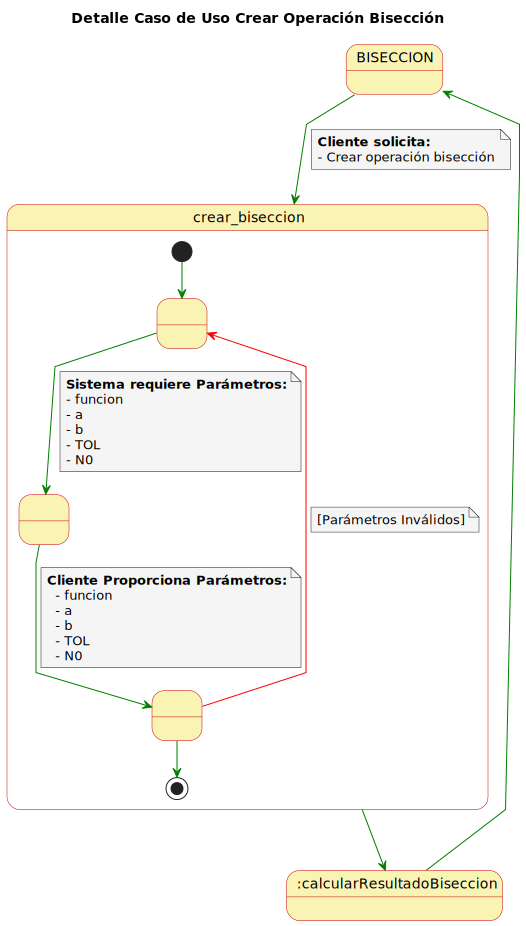
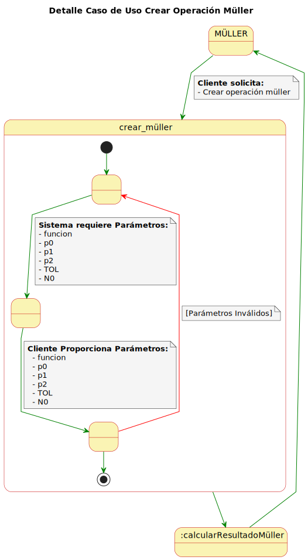

# Casos de Uso

## Índice

1. [Actores y Casos de Uso](#actores-y-casos-de-uso)
2. [Detalles de los Casos de Uso](#detalles-de-los-casos-de-uso)
3. [Diagrama de Contexto Módulo Ecuaciones Una Variable](#diagrama-de-contexto-módulo-ecuaciones-una-variable)

## Actores y Casos de Uso

### Actores

- Usuario

### Casos de uso

#### - Estado Principal

Permite al usuario listar módulos.

|                                                        |                                                          |
| ------------------------------------------------------ | -------------------------------------------------------- |
|    | [Código PUML](../casosDeUso/casoUsoEstadoPrincipal.puml) |

#### - Ecuaciones Una Variable

Ofrece opciones para listar las operaciones y permite abrir la operación que queremos realizar.

|                                                              |                                                                |
| ------------------------------------------------------------ | -------------------------------------------------------------- |
|    | [Código PUML](../casosDeUso/casosUsoEcuacionesUnaVariable/casoUsoEcuacionesUnaVariable.puml) |

#### -Bisección

Ofrece la opción de crear un operación de bisección.

|                                                              |                                                                |
| ------------------------------------------------------------ | -------------------------------------------------------------- |
|    | [Código PUML](../casosDeUso/casosUsoEcuacionesUnaVariable/casoUsoBisección.puml) |

#### - Punto Fijo

Ofrece la opción de crear un operación de punto fijo.

|                                                              |                                                                |
| ------------------------------------------------------------ | -------------------------------------------------------------- |
|    | [Código PUML](../casosDeUso/casosUsoEcuacionesUnaVariable/casoUsoPuntoFijo.puml) |

#### - Newton

Ofrece la opción de crear un operación de newton.

|                                                              |                                                                |
| ------------------------------------------------------------ | -------------------------------------------------------------- |
|    | [Código PUML](../casosDeUso/casosUsoEcuacionesUnaVariable/casoUsoNewton.puml) |

#### - Secante

Ofrece la opción de crear un operación de secante.

|                                                              |                                                                |
| ------------------------------------------------------------ | -------------------------------------------------------------- |
|    | [Código PUML](../casosDeUso/casosUsoEcuacionesUnaVariable/casoUsoSecante.puml) |

#### - Falsa Posición

Ofrece la opción de crear un operación de falsa posición.

|                                                              |                                                                |
| ------------------------------------------------------------ | -------------------------------------------------------------- |
|    | [Código PUML](../casosDeUso/casosUsoEcuacionesUnaVariable/casoUsoFalsaPosición.puml) |

#### - Steffensen

Ofrece la opción de crear un operación de steffensen.

|                                                              |                                                                |
| ------------------------------------------------------------ | -------------------------------------------------------------- |
|    | [Código PUML](../casosDeUso/casosUsoEcuacionesUnaVariable/casoUsoSteffensen.puml) |

#### - Horner

Ofrece la opción de crear un operación de horner.

|                                                              |                                                                |
| ------------------------------------------------------------ | -------------------------------------------------------------- |
|    | [Código PUML](../casosDeUso/casosUsoEcuacionesUnaVariable/casoUsoHorner.puml) |

#### - Müller

Ofrece la opción de crear un operación de müller.

|                                                              |                                                                |
| ------------------------------------------------------------ | -------------------------------------------------------------- |
|    | [Código PUML](../casosDeUso/casosUsoEcuacionesUnaVariable/casoUsoMüller.puml) |

---

## Detalles de los Casos de Uso

#### - Listar Módulos

|                                                                        |                                                                          |
| ---------------------------------------------------------------------- | ------------------------------------------------------------------------ |
|  | [Código PUML](../casosDeUso/detalleCasoUsoListarMódulos.puml) |

#### - Listar Operaciones

|                                                                        |                                                                          |
| ---------------------------------------------------------------------- | ------------------------------------------------------------------------ |
|  | [Código PUML](../casosDeUso/detallesCasosUsoEcuacionesUnaVariable/detalleCasoUsoListarOperaciones.puml) |

#### - Abrir Método Bisección

|                                                                        |                                                                          |
| ---------------------------------------------------------------------- | ------------------------------------------------------------------------ |
|  | [Código PUML](../casosDeUso/detallesCasosUsoEcuacionesUnaVariable/detalleCasoUsoAbrirBisección.puml) |

#### - Crear Operación Bisección

|                                                                        |                                                                          |
| ---------------------------------------------------------------------- | ------------------------------------------------------------------------ |
|  | [Código PUML](../casosDeUso/detallesCasosUsoEcuacionesUnaVariable/detalleCasoUsoCrearBisección.puml) |

#### - Abrir Método Punto Fijo

|                                                                        |                                                                          |
| ---------------------------------------------------------------------- | ------------------------------------------------------------------------ |
|  | [Código PUML](../casosDeUso/detallesCasosUsoEcuacionesUnaVariable/detalleCasoUsoAbrirPuntoFijo.puml) |

#### - Crear Operación Punto Fijo

|                                                                        |                                                                          |
| ---------------------------------------------------------------------- | ------------------------------------------------------------------------ |
|  | [Código PUML](../casosDeUso/detallesCasosUsoEcuacionesUnaVariable/detalleCasoUsoCrearPuntoFijo.puml) |

#### - Abrir Método Newton

|                                                                        |                                                                          |
| ---------------------------------------------------------------------- | ------------------------------------------------------------------------ |
|  | [Código PUML](../casosDeUso/detallesCasosUsoEcuacionesUnaVariable/detalleCasoUsoAbrirNewton.puml) |

#### - Crear Operación Newton

|                                                                        |                                                                          |
| ---------------------------------------------------------------------- | ------------------------------------------------------------------------ |
|  | [Código PUML](../casosDeUso/detallesCasosUsoEcuacionesUnaVariable/detalleCasoUsoCrearNewton.puml) |

#### - Abrir Método Secante

|                                                                        |                                                                          |
| ---------------------------------------------------------------------- | ------------------------------------------------------------------------ |
|  | [Código PUML](../casosDeUso/detallesCasosUsoEcuacionesUnaVariable/detalleCasoUsoAbrirSecante.puml) |

#### - Crear Operación Secante

|                                                                        |                                                                          |
| ---------------------------------------------------------------------- | ------------------------------------------------------------------------ |
|  | [Código PUML](../casosDeUso/detallesCasosUsoEcuacionesUnaVariable/detalleCasoUsoCrearSecante.puml) |

#### - Abrir Método Falsa Posición

|                                                                        |                                                                          |
| ---------------------------------------------------------------------- | ------------------------------------------------------------------------ |
|  | [Código PUML](../casosDeUso/detallesCasosUsoEcuacionesUnaVariable/detalleCasoUsoAbrirFalsaPosición.puml) |

#### - Crear Operación Falsa Posición

|                                                                        |                                                                          |
| ---------------------------------------------------------------------- | ------------------------------------------------------------------------ |
|  | [Código PUML](../casosDeUso/detallesCasosUsoEcuacionesUnaVariable/detalleCasoUsoCrearFalsaPosición.puml) |

#### - Abrir Método Steffensen

|                                                                        |                                                                          |
| ---------------------------------------------------------------------- | ------------------------------------------------------------------------ |
|  | [Código PUML](../casosDeUso/detallesCasosUsoEcuacionesUnaVariable/detalleCasoUsoAbrirSteffensen.puml) |

#### - Crear Operación Steffensen

|                                                                        |                                                                          |
| ---------------------------------------------------------------------- | ------------------------------------------------------------------------ |
|  | [Código PUML](../casosDeUso/detallesCasosUsoEcuacionesUnaVariable/detalleCasoUsoCrearSteffensen.puml) |

#### - Abrir Método Horner

|                                                                        |                                                                          |
| ---------------------------------------------------------------------- | ------------------------------------------------------------------------ |
|  | [Código PUML](../casosDeUso/detallesCasosUsoEcuacionesUnaVariable/detalleCasoUsoAbrirHorner.puml) |

#### - Crear Operación Horner

|                                                                        |                                                                          |
| ---------------------------------------------------------------------- | ------------------------------------------------------------------------ |
|  | [Código PUML](../casosDeUso/detallesCasosUsoEcuacionesUnaVariable/detalleCasoUsoCrearHorner.puml) |

#### - Abrir Método Müller

|                                                                        |                                                                          |
| ---------------------------------------------------------------------- | ------------------------------------------------------------------------ |
|  | [Código PUML](../casosDeUso/detallesCasosUsoEcuacionesUnaVariable/detalleCasoUsoAbrirMüller.puml) |

#### - Crear Operación Müller

|                                                                        |                                                                          |
| ---------------------------------------------------------------------- | ------------------------------------------------------------------------ |
|  | [Código PUML](../casosDeUso/detallesCasosUsoEcuacionesUnaVariable/detalleCasoUsoCrearMüller.puml) |

---

## Diagrama de Contexto Módulo Ecuaciones Una Variable

|                                                    |                                                    |
| -------------------------------------------------- | -------------------------------------------------- |
|  | [Código PUML](../casosDeUso/casosUsoEcuacionesUnaVariable/diagramaContexto.puml) |
