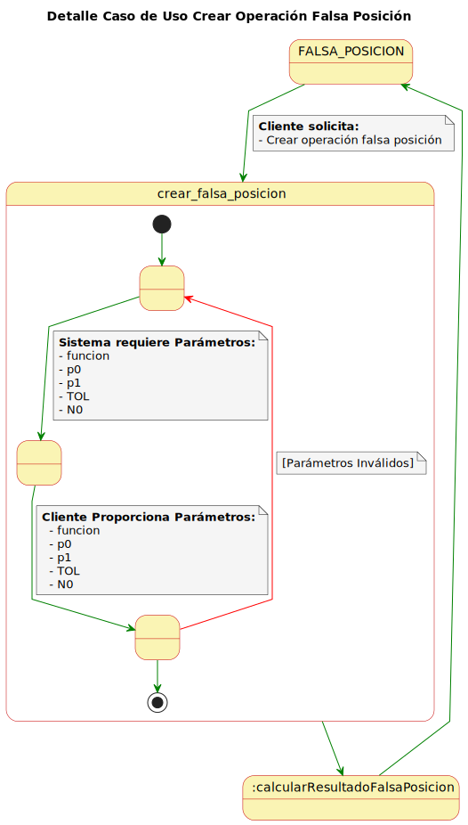

# Casos de Uso

## Índice

1. [Actores](#actores)
2. [Casos de Uso Módulo Ecuaciones Una Variable](#casos-de-uso-módulo-ecuaciones-una-variable)
3. [Casos de Uso Módulo Diferenciación Numérica e Integración](#casos-de-uso-módulo-diferenciación-numérica-e-integración)
4. [Detalles de los Casos de Uso Módulo Ecuaciones Una Variable](#detalles-de-los-casos-de-uso-módulo-ecuaciones-una-variable)
5. [Detalles de los Casos de Uso Módulo Diferenciación Numérica e Integración](#detalles-de-los-casos-de-uso-módulo-diferenciación-numérica-e-integración)
6. [Diagrama de Contexto Módulo Ecuaciones Una Variable](#diagrama-de-contexto-módulo-ecuaciones-una-variable)
7. [Diagrama de Contexto Módulo Diferenciación Numérica e Integración](#diagrama-de-contexto-módulo-diferenciación-numérica-e-integración)

## Actores

- Usuario

## Casos de Uso

#### - Estado Principal

Permite al usuario listar módulos.

|                                                        |                                                          |
| ------------------------------------------------------ | -------------------------------------------------------- |
|    | [Código PUML](../casosDeUso/casoUsoEstadoPrincipal.puml) |

### Casos de Uso Módulo Ecuaciones Una Variable

#### - Ecuaciones Una Variable

Ofrece opciones para listar las operaciones y permite abrir la operación que queremos realizar.

|                                                              |                                                                |
| ------------------------------------------------------------ | -------------------------------------------------------------- |
|    | [Código PUML](../casosDeUso/casosUsoEcuacionesUnaVariable/casoUsoEcuacionesUnaVariable.puml) |

#### -Bisección

Ofrece la opción de crear una operación de bisección.

|                                                              |                                                                |
| ------------------------------------------------------------ | -------------------------------------------------------------- |
|    | [Código PUML](../casosDeUso/casosUsoEcuacionesUnaVariable/casoUsoBisección.puml) |

#### - Punto Fijo

Ofrece la opción de crear una operación de punto fijo.

|                                                              |                                                                |
| ------------------------------------------------------------ | -------------------------------------------------------------- |
|    | [Código PUML](../casosDeUso/casosUsoEcuacionesUnaVariable/casoUsoPuntoFijo.puml) |

#### - Newton

Ofrece la opción de crear una operación de newton.

|                                                              |                                                                |
| ------------------------------------------------------------ | -------------------------------------------------------------- |
|    | [Código PUML](../casosDeUso/casosUsoEcuacionesUnaVariable/casoUsoNewton.puml) |

#### - Secante

Ofrece la opción de crear una operación de secante.

|                                                              |                                                                |
| ------------------------------------------------------------ | -------------------------------------------------------------- |
|    | [Código PUML](../casosDeUso/casosUsoEcuacionesUnaVariable/casoUsoSecante.puml) |

#### - Falsa Posición

Ofrece la opción de crear una operación de falsa posición.

|                                                              |                                                                |
| ------------------------------------------------------------ | -------------------------------------------------------------- |
|    | [Código PUML](../casosDeUso/casosUsoEcuacionesUnaVariable/casoUsoFalsaPosición.puml) |

#### - Steffensen

Ofrece la opción de crear una operación de steffensen.

|                                                              |                                                                |
| ------------------------------------------------------------ | -------------------------------------------------------------- |
|    | [Código PUML](../casosDeUso/casosUsoEcuacionesUnaVariable/casoUsoSteffensen.puml) |

#### - Horner

Ofrece la opción de crear una operación de horner.

|                                                              |                                                                |
| ------------------------------------------------------------ | -------------------------------------------------------------- |
|    | [Código PUML](../casosDeUso/casosUsoEcuacionesUnaVariable/casoUsoHorner.puml) |

#### - Müller

Ofrece la opción de crear una operación de müller.

|                                                              |                                                                |
| ------------------------------------------------------------ | -------------------------------------------------------------- |
|    | [Código PUML](../casosDeUso/casosUsoEcuacionesUnaVariable/casoUsoMüller.puml) |

---

### Casos de Uso Módulo Diferenciación Numérica e Integración

#### - Diferenciación Numérica e Integración

Ofrece opciones para listar las operaciones y permite abrir la operación que queremos realizar.

|                                                              |                                                                |
| ------------------------------------------------------------ | -------------------------------------------------------------- |
|    | [Código PUML](../casosDeUso/casosUsoDiferenciacionNumericaEIntegracion/casoUsoDiferenciacionNumericaEIntegracion.puml) |

#### - Punto Medio de 3 Puntos

Ofrece la opción de crear una operación de punto medio de 3 puntos.

|                                                              |                                                                |
| ------------------------------------------------------------ | -------------------------------------------------------------- |
|    | [Código PUML](../casosDeUso/casosUsoDiferenciacionNumericaEIntegracion/casoUsoPuntoMedio3Puntos.puml) |

#### - Extremo de 3 Puntos

Ofrece la opción de crear una operación de extremo de 3 puntos.

|                                                              |                                                                |
| ------------------------------------------------------------ | -------------------------------------------------------------- |
|    | [Código PUML](../casosDeUso/casosUsoDiferenciacionNumericaEIntegracion/casoUsoExtremo3Puntos.puml) |

#### - Punto Medio de 5 Puntos

Ofrece la opción de crear una operación de punto medio de 5 puntos.

|                                                              |                                                                |
| ------------------------------------------------------------ | -------------------------------------------------------------- |
|    | [Código PUML](../casosDeUso/casosUsoDiferenciacionNumericaEIntegracion/casoUsoPuntoMedio5Puntos.puml) |

#### - Extremo de 5 Puntos

Ofrece la opción de crear un operación de extremo de 5 puntos.

|                                                              |                                                                |
| ------------------------------------------------------------ | -------------------------------------------------------------- |
|    | [Código PUML](../casosDeUso/casosUsoDiferenciacionNumericaEIntegracion/casoUsoExtremo5Puntos.puml) |

#### - Punto Medio 2º Derivada

Ofrece la opción de crear una operación de punto medio 2º derivada.

|                                                              |                                                                |
| ------------------------------------------------------------ | -------------------------------------------------------------- |
|    | [Código PUML](../casosDeUso/casosUsoDiferenciacionNumericaEIntegracion/casoUsoPuntoMedio2Derivada.puml) |

#### - Newton Cotes Cerrado n=1

Ofrece la opción de crear una operación de newton cotes cerrado n=1.

|                                                              |                                                                |
| ------------------------------------------------------------ | -------------------------------------------------------------- |
|    | [Código PUML](../casosDeUso/casosUsoDiferenciacionNumericaEIntegracion/casoUsoNewtonCotesC1.puml) |

#### - Newton Cotes Cerrado n=2

Ofrece la opción de crear una operación de newton cotes cerrado n=2.

|                                                              |                                                                |
| ------------------------------------------------------------ | -------------------------------------------------------------- |
|    | [Código PUML](../casosDeUso/casosUsoDiferenciacionNumericaEIntegracion/casoUsoNewtonCotesC2.puml) |

#### - Newton Cotes Cerrado n=3

Ofrece la opción de crear una operación de newton cotes cerrado n=3.

|                                                              |                                                                |
| ------------------------------------------------------------ | -------------------------------------------------------------- |
|    | [Código PUML](../casosDeUso/casosUsoDiferenciacionNumericaEIntegracion/casoUsoNewtonCotesC3.puml) |

#### - Newton Cotes Cerrado n=4

Ofrece la opción de crear una operación de newton cotes cerrado n=4.

|                                                              |                                                                |
| ------------------------------------------------------------ | -------------------------------------------------------------- |
|    | [Código PUML](../casosDeUso/casosUsoDiferenciacionNumericaEIntegracion/casoUsoNewtonCotesC4.puml) |

#### - Newton Cotes Abierto n=0

Ofrece la opción de crear una operación de newton cotes abierto n=0.

|                                                              |                                                                |
| ------------------------------------------------------------ | -------------------------------------------------------------- |
|    | [Código PUML](../casosDeUso/casosUsoDiferenciacionNumericaEIntegracion/casoUsoNewtonCotesA0.puml) |

#### - Newton Cotes Abierto n=1

Ofrece la opción de crear una operación de newton cotes abierto n=1.

|                                                              |                                                                |
| ------------------------------------------------------------ | -------------------------------------------------------------- |
|    | [Código PUML](../casosDeUso/casosUsoDiferenciacionNumericaEIntegracion/casoUsoNewtonCotesA1.puml) |

#### - Newton Cotes Abierto n=2

Ofrece la opción de crear una operación de newton cotes abierto n=2.

|                                                              |                                                                |
| ------------------------------------------------------------ | -------------------------------------------------------------- |
|    | [Código PUML](../casosDeUso/casosUsoDiferenciacionNumericaEIntegracion/casoUsoNewtonCotesA2.puml) |

#### - Newton Cotes Abierto n=3

Ofrece la opción de crear una operación de newton cotes abierto n=3.

|                                                              |                                                                |
| ------------------------------------------------------------ | -------------------------------------------------------------- |
|    | [Código PUML](../casosDeUso/casosUsoDiferenciacionNumericaEIntegracion/casoUsoNewtonCotesA3.puml) |

#### - Regla Trapezoidal Compuesta

Ofrece la opción de crear una operación de trapezoidal compuesta.

|                                                              |                                                                |
| ------------------------------------------------------------ | -------------------------------------------------------------- |
|    | [Código PUML](../casosDeUso/casosUsoDiferenciacionNumericaEIntegracion/casoUsoTrapezoidalCompuesta.puml) |

#### - Regla Simpson Compuesta

Ofrece la opción de crear una operación de simpson compuesta.

|                                                              |                                                                |
| ------------------------------------------------------------ | -------------------------------------------------------------- |
|    | [Código PUML](../casosDeUso/casosUsoDiferenciacionNumericaEIntegracion/casoUsoSimpsonCompuesta.puml) |

#### - Regla Punto Medio Compuesta

Ofrece la opción de crear una operación de punto medio compuesta.

|                                                              |                                                                |
| ------------------------------------------------------------ | -------------------------------------------------------------- |
|    | [Código PUML](../casosDeUso/casosUsoDiferenciacionNumericaEIntegracion/casoUsoPuntoMedio3Puntos.puml) |

#### - Integración de Romberg

Ofrece la opción de crear una operación de integración de romberg.

|                                                              |                                                                |
| ------------------------------------------------------------ | -------------------------------------------------------------- |
|    | [Código PUML](../casosDeUso/casosUsoDiferenciacionNumericaEIntegracion/casoUsoIntegracionRomberg.puml) |

#### - Integral Doble de Simpson

Ofrece la opción de crear una operación de integral doble de simpson.

|                                                              |                                                                |
| ------------------------------------------------------------ | -------------------------------------------------------------- |
|    | [Código PUML](../casosDeUso/casosUsoDiferenciacionNumericaEIntegracion/casoUsoIntegralDobleSimpson.puml) |

#### - Integral Doble Gaussiana

Ofrece la opción de crear una operación de integral doble gaussiana.

|                                                              |                                                                |
| ------------------------------------------------------------ | -------------------------------------------------------------- |
|    | [Código PUML](../casosDeUso/casosUsoDiferenciacionNumericaEIntegracion/casoUsoIntegralDobleGaussiana.puml) |

#### - Integral Triple Gaussiana

Ofrece la opción de crear una operación de integral triple gaussiana.

|                                                              |                                                                |
| ------------------------------------------------------------ | -------------------------------------------------------------- |
|    | [Código PUML](../casosDeUso/casosUsoDiferenciacionNumericaEIntegracion/casoUsoIntegralTripleGaussiana.puml) |

---

## Detalles de los Casos de Uso

#### - Listar Módulos

|                                                                        |                                                                          |
| ---------------------------------------------------------------------- | ------------------------------------------------------------------------ |
|  | [Código PUML](../casosDeUso/detalleCasoUsoListarMódulos.puml) |

### Detalles de los Casos de Uso Módulo Ecuaciones Una Variable

#### - Listar Operaciones

|                                                                        |                                                                          |
| ---------------------------------------------------------------------- | ------------------------------------------------------------------------ |
|  | [Código PUML](../casosDeUso/detallesCasosUsoEcuacionesUnaVariable/detalleCasoUsoListarOperaciones.puml) |

#### - Abrir Método Bisección

|                                                                        |                                                                          |
| ---------------------------------------------------------------------- | ------------------------------------------------------------------------ |
|  | [Código PUML](../casosDeUso/detallesCasosUsoEcuacionesUnaVariable/detalleCasoUsoAbrirBisección.puml) |

#### - Crear Operación Bisección

|                                                                        |                                                                          |
| ---------------------------------------------------------------------- | ------------------------------------------------------------------------ |
|  | [Código PUML](../casosDeUso/detallesCasosUsoEcuacionesUnaVariable/detalleCasoUsoCrearBisección.puml) |

#### - Abrir Método Punto Fijo

|                                                                        |                                                                          |
| ---------------------------------------------------------------------- | ------------------------------------------------------------------------ |
|  | [Código PUML](../casosDeUso/detallesCasosUsoEcuacionesUnaVariable/detalleCasoUsoAbrirPuntoFijo.puml) |

#### - Crear Operación Punto Fijo

|                                                                        |                                                                          |
| ---------------------------------------------------------------------- | ------------------------------------------------------------------------ |
|  | [Código PUML](../casosDeUso/detallesCasosUsoEcuacionesUnaVariable/detalleCasoUsoCrearPuntoFijo.puml) |

#### - Abrir Método Newton

|                                                                        |                                                                          |
| ---------------------------------------------------------------------- | ------------------------------------------------------------------------ |
|  | [Código PUML](../casosDeUso/detallesCasosUsoEcuacionesUnaVariable/detalleCasoUsoAbrirNewton.puml) |

#### - Crear Operación Newton

|                                                                        |                                                                          |
| ---------------------------------------------------------------------- | ------------------------------------------------------------------------ |
|  | [Código PUML](../casosDeUso/detallesCasosUsoEcuacionesUnaVariable/detalleCasoUsoCrearNewton.puml) |

#### - Abrir Método Secante

|                                                                        |                                                                          |
| ---------------------------------------------------------------------- | ------------------------------------------------------------------------ |
|  | [Código PUML](../casosDeUso/detallesCasosUsoEcuacionesUnaVariable/detalleCasoUsoAbrirSecante.puml) |

#### - Crear Operación Secante

|                                                                        |                                                                          |
| ---------------------------------------------------------------------- | ------------------------------------------------------------------------ |
|  | [Código PUML](../casosDeUso/detallesCasosUsoEcuacionesUnaVariable/detalleCasoUsoCrearSecante.puml) |

#### - Abrir Método Falsa Posición

|                                                                        |                                                                          |
| ---------------------------------------------------------------------- | ------------------------------------------------------------------------ |
|  | [Código PUML](../casosDeUso/detallesCasosUsoEcuacionesUnaVariable/detalleCasoUsoAbrirFalsaPosición.puml) |

#### - Crear Operación Falsa Posición

|                                                                        |                                                                          |
| ---------------------------------------------------------------------- | ------------------------------------------------------------------------ |
|  | [Código PUML](../casosDeUso/detallesCasosUsoEcuacionesUnaVariable/detalleCasoUsoCrearFalsaPosición.puml) |

#### - Abrir Método Steffensen

|                                                                        |                                                                          |
| ---------------------------------------------------------------------- | ------------------------------------------------------------------------ |
|  | [Código PUML](../casosDeUso/detallesCasosUsoEcuacionesUnaVariable/detalleCasoUsoAbrirSteffensen.puml) |

#### - Crear Operación Steffensen

|                                                                        |                                                                          |
| ---------------------------------------------------------------------- | ------------------------------------------------------------------------ |
|  | [Código PUML](../casosDeUso/detallesCasosUsoEcuacionesUnaVariable/detalleCasoUsoCrearSteffensen.puml) |

#### - Abrir Método Horner

|                                                                        |                                                                          |
| ---------------------------------------------------------------------- | ------------------------------------------------------------------------ |
|  | [Código PUML](../casosDeUso/detallesCasosUsoEcuacionesUnaVariable/detalleCasoUsoAbrirHorner.puml) |

#### - Crear Operación Horner

|                                                                        |                                                                          |
| ---------------------------------------------------------------------- | ------------------------------------------------------------------------ |
|  | [Código PUML](../casosDeUso/detallesCasosUsoEcuacionesUnaVariable/detalleCasoUsoCrearHorner.puml) |

#### - Abrir Método Müller

|                                                                        |                                                                          |
| ---------------------------------------------------------------------- | ------------------------------------------------------------------------ |
|  | [Código PUML](../casosDeUso/detallesCasosUsoEcuacionesUnaVariable/detalleCasoUsoAbrirMüller.puml) |

#### - Crear Operación Müller

|                                                                        |                                                                          |
| ---------------------------------------------------------------------- | ------------------------------------------------------------------------ |
|  | [Código PUML](../casosDeUso/detallesCasosUsoEcuacionesUnaVariable/detalleCasoUsoCrearMüller.puml) |

---

### Detalles de los Casos de Uso Módulo Diferenciación Numérica e Integración

#### - Listar Operaciones

|                                                                        |                                                                          |
| ---------------------------------------------------------------------- | ------------------------------------------------------------------------ |
|  | [Código PUML](../casosDeUso/detallesCasosUsoDiferenciacionNumericaEIntegracion/detalleCasoUsoListarOperaciones.puml) |

#### - Abrir Punto Medio de 3 Puntos

|                                                                        |                                                                          |
| ---------------------------------------------------------------------- | ------------------------------------------------------------------------ |
|  | [Código PUML](../casosDeUso/detallesCasosUsoDiferenciacionNumericaEIntegracion/detalleCasoUsoAbrirPuntoMedio3Puntos.puml) |

#### - Crear Operación Punto Medio de 3 Puntos

|                                                                        |                                                                          |
| ---------------------------------------------------------------------- | ------------------------------------------------------------------------ |
|  | [Código PUML](../casosDeUso/detallesCasosUsoDiferenciacionNumericaEIntegracion/detalleCasoUsoCrearPuntoMedio3Puntos.puml) |

#### - Abrir Extremo de 3 Puntos

|                                                                        |                                                                          |
| ---------------------------------------------------------------------- | ------------------------------------------------------------------------ |
|  | [Código PUML](../casosDeUso/detallesCasosUsoDiferenciacionNumericaEIntegracion/detalleCasoUsoAbrirExtremo3Puntos.puml) |

#### - Crear Operación Extremo de 3 Puntos

|                                                                        |                                                                          |
| ---------------------------------------------------------------------- | ------------------------------------------------------------------------ |
|  | [Código PUML](../casosDeUso/detallesCasosUsoDiferenciacionNumericaEIntegracion/detalleCasoUsoCrearExtremo3Puntos.puml) |

#### - Abrir Punto Medio de 5 Puntos

|                                                                        |                                                                          |
| ---------------------------------------------------------------------- | ------------------------------------------------------------------------ |
|  | [Código PUML](../casosDeUso/detallesCasosUsoDiferenciacionNumericaEIntegracion/detalleCasoUsoAbrirPuntoMedio5Puntos.puml) |

#### - Crear Operación Punto Medio de 5 Puntos

|                                                                        |                                                                          |
| ---------------------------------------------------------------------- | ------------------------------------------------------------------------ |
|  | [Código PUML](../casosDeUso/detallesCasosUsoDiferenciacionNumericaEIntegracion/detalleCasoUsoCrearPuntoMedio5Puntos.puml) |

#### - Abrir Extremo de 5 Puntos

|                                                                        |                                                                          |
| ---------------------------------------------------------------------- | ------------------------------------------------------------------------ |
|  | [Código PUML](../casosDeUso/detallesCasosUsoDiferenciacionNumericaEIntegracion/detalleCasoUsoAbrirExtremo5Puntos.puml) |

#### - Crear Operación Extremo de 5 Puntos

|                                                                        |                                                                          |
| ---------------------------------------------------------------------- | ------------------------------------------------------------------------ |
|  | [Código PUML](../casosDeUso/detallesCasosUsoDiferenciacionNumericaEIntegracion/detalleCasoUsoCrearExtremo5Puntos.puml) |

#### - Abrir Punto Medio 2º Derivada

|                                                                        |                                                                          |
| ---------------------------------------------------------------------- | ------------------------------------------------------------------------ |
|  | [Código PUML](../casosDeUso/detallesCasosUsoDiferenciacionNumericaEIntegracion/detalleCasoUsoAbrirPuntoMedio2Derivada.puml) |

#### - Crear Operación Punto Medio 2º Derivada

|                                                                        |                                                                          |
| ---------------------------------------------------------------------- | ------------------------------------------------------------------------ |
|  | [Código PUML](../casosDeUso/detallesCasosUsoDiferenciacionNumericaEIntegracion/detalleCasoUsoCrearPuntoMedio2Derivada.puml) |

#### - Abrir Newton Cotes Cerrado n=1

|                                                                        |                                                                          |
| ---------------------------------------------------------------------- | ------------------------------------------------------------------------ |
|  | [Código PUML](../casosDeUso/detallesCasosUsoDiferenciacionNumericaEIntegracion/detalleCasoAbrirNewtonCotesC1.puml) |

#### - Crear Operación Newton Cotes Cerrado n=1

|                                                                        |                                                                          |
| ---------------------------------------------------------------------- | ------------------------------------------------------------------------ |
|  | [Código PUML](../casosDeUso/detallesCasosUsoDiferenciacionNumericaEIntegracion/detalleCasoUsoCrearNewtonCotesC1.puml) |

#### - Abrir Newton Cotes Cerrado n=2

|                                                                        |                                                                          |
| ---------------------------------------------------------------------- | ------------------------------------------------------------------------ |
|  | [Código PUML](../casosDeUso/detallesCasosUsoDiferenciacionNumericaEIntegracion/detalleCasoAbrirNewtonCotesC2.puml) |

#### - Crear Operación Newton Cotes Cerrado n=2

|                                                                        |                                                                          |
| ---------------------------------------------------------------------- | ------------------------------------------------------------------------ |
|  | [Código PUML](../casosDeUso/detallesCasosUsoDiferenciacionNumericaEIntegracion/detalleCasoUsoCrearNewtonCotesC2.puml) |

#### - Abrir Newton Cotes Cerrado n=3

|                                                                        |                                                                          |
| ---------------------------------------------------------------------- | ------------------------------------------------------------------------ |
|  | [Código PUML](../casosDeUso/detallesCasosUsoDiferenciacionNumericaEIntegracion/detalleCasoAbrirNewtonCotesC3.puml) |

#### - Crear Operación Newton Cotes Cerrado n=3

|                                                                        |                                                                          |
| ---------------------------------------------------------------------- | ------------------------------------------------------------------------ |
|  | [Código PUML](../casosDeUso/detallesCasosUsoDiferenciacionNumericaEIntegracion/detalleCasoUsoCrearNewtonCotesC3.puml) |

#### - Abrir Newton Cotes Cerrado n=4

|                                                                        |                                                                          |
| ---------------------------------------------------------------------- | ------------------------------------------------------------------------ |
|  | [Código PUML](../casosDeUso/detallesCasosUsoDiferenciacionNumericaEIntegracion/detalleCasoAbrirNewtonCotesC4.puml) |

#### - Crear Operación Newton Cotes Cerrado n=4

|                                                                        |                                                                          |
| ---------------------------------------------------------------------- | ------------------------------------------------------------------------ |
|  | [Código PUML](../casosDeUso/detallesCasosUsoDiferenciacionNumericaEIntegracion/detalleCasoUsoCrearNewtonCotesC4.puml) |

#### - Abrir Newton Cotes Abierto n=0

|                                                                        |                                                                          |
| ---------------------------------------------------------------------- | ------------------------------------------------------------------------ |
|  | [Código PUML](../casosDeUso/detallesCasosUsoDiferenciacionNumericaEIntegracion/detalleCasoAbrirNewtonCotesA0.puml) |

#### - Crear Operación Newton Cotes Abierto n=0

|                                                                        |                                                                          |
| ---------------------------------------------------------------------- | ------------------------------------------------------------------------ |
|  | [Código PUML](../casosDeUso/detallesCasosUsoDiferenciacionNumericaEIntegracion/detalleCasoUsoCrearNewtonCotesA0.puml) |

#### - Abrir Newton Cotes Abierto n=1

|                                                                        |                                                                          |
| ---------------------------------------------------------------------- | ------------------------------------------------------------------------ |
|  | [Código PUML](../casosDeUso/detallesCasosUsoDiferenciacionNumericaEIntegracion/detalleCasoAbrirNewtonCotesA1.puml) |

#### - Crear Operación Newton Cotes Abierto n=1

|                                                                        |                                                                          |
| ---------------------------------------------------------------------- | ------------------------------------------------------------------------ |
|  | [Código PUML](../casosDeUso/detallesCasosUsoDiferenciacionNumericaEIntegracion/detalleCasoUsoCrearNewtonCotesA1.puml) |

#### - Abrir Newton Cotes Abierto n=2

|                                                                        |                                                                          |
| ---------------------------------------------------------------------- | ------------------------------------------------------------------------ |
|  | [Código PUML](../casosDeUso/detallesCasosUsoDiferenciacionNumericaEIntegracion/detalleCasoAbrirNewtonCotesA2.puml) |

#### - Crear Operación Newton Cotes Abierto n=2

|                                                                        |                                                                          |
| ---------------------------------------------------------------------- | ------------------------------------------------------------------------ |
|  | [Código PUML](../casosDeUso/detallesCasosUsoDiferenciacionNumericaEIntegracion/detalleCasoUsoCrearNewtonCotesA2.puml) |

#### - Abrir Newton Cotes Abierto n=3

|                                                                        |                                                                          |
| ---------------------------------------------------------------------- | ------------------------------------------------------------------------ |
|  | [Código PUML](../casosDeUso/detallesCasosUsoDiferenciacionNumericaEIntegracion/detalleCasoAbrirNewtonCotesA3.puml) |

#### - Crear Operación Newton Cotes Abierto n=3

|                                                                        |                                                                          |
| ---------------------------------------------------------------------- | ------------------------------------------------------------------------ |
|  | [Código PUML](../casosDeUso/detallesCasosUsoDiferenciacionNumericaEIntegracion/detalleCasoUsoCrearNewtonCotesA3.puml) |

#### - Abrir Regla Trapezoidal Compuesta

|                                                                        |                                                                          |
| ---------------------------------------------------------------------- | ------------------------------------------------------------------------ |
|  | [Código PUML](../casosDeUso/detallesCasosUsoDiferenciacionNumericaEIntegracion/detalleCasoUsoAbrirTrapezoidalCompuesta.puml) |

#### - Crear Operación Regla Trapezoidal Compuesta

|                                                                        |                                                                          |
| ---------------------------------------------------------------------- | ------------------------------------------------------------------------ |
|  | [Código PUML](../casosDeUso/detallesCasosUsoDiferenciacionNumericaEIntegracion/detalleCasoUsoCrearTrapezoidalCompuesta.puml) |

#### - Abrir Regla Simpson Compuesta

|                                                                        |                                                                          |
| ---------------------------------------------------------------------- | ------------------------------------------------------------------------ |
|  | [Código PUML](../casosDeUso/detallesCasosUsoDiferenciacionNumericaEIntegracion/detalleCasoUsoAbrirSimpsonCompuesta.puml) |

#### - Crear Operación Regla Simpson Compuesta

|                                                                        |                                                                          |
| ---------------------------------------------------------------------- | ------------------------------------------------------------------------ |
|  | [Código PUML](../casosDeUso/detallesCasosUsoDiferenciacionNumericaEIntegracion/detalleCasoUsoCrearSimpsonCompuesta.puml) |

#### - Abrir Regla Punto Medio Compuesta

|                                                                        |                                                                          |
| ---------------------------------------------------------------------- | ------------------------------------------------------------------------ |
|  | [Código PUML](../casosDeUso/detallesCasosUsoDiferenciacionNumericaEIntegracion/detalleCasoUsoAbrirPuntoMedioCompuesta.puml) |

#### - Crear Operación Regla Punto Medio Compuesta

|                                                                        |                                                                          |
| ---------------------------------------------------------------------- | ------------------------------------------------------------------------ |
|  | [Código PUML](../casosDeUso/detallesCasosUsoDiferenciacionNumericaEIntegracion/detalleCasoUsoCrearPuntoMedioCompuesta.puml) |

#### - Abrir Integración de Romberg

|                                                                        |                                                                          |
| ---------------------------------------------------------------------- | ------------------------------------------------------------------------ |
|  | [Código PUML](../casosDeUso/detallesCasosUsoDiferenciacionNumericaEIntegracion/detalleCasoUsoAbrirIntegracionRomberg.puml) |

#### - Crear Operación Integración de Romberg

|                                                                        |                                                                          |
| ---------------------------------------------------------------------- | ------------------------------------------------------------------------ |
|  | [Código PUML](../casosDeUso/detallesCasosUsoDiferenciacionNumericaEIntegracion/detalleCasoUsoCrearIntegracionRomberg.puml) |

#### - Abrir Integral Doble de Simpson

|                                                                        |                                                                          |
| ---------------------------------------------------------------------- | ------------------------------------------------------------------------ |
|  | [Código PUML](../casosDeUso/detallesCasosUsoDiferenciacionNumericaEIntegracion/detalleCasoUsoAbrirIntegralDobleSimpson.puml) |

#### - Crear Operación Integral Doble de Simpson

|                                                                        |                                                                          |
| ---------------------------------------------------------------------- | ------------------------------------------------------------------------ |
|  | [Código PUML](../casosDeUso/detallesCasosUsoDiferenciacionNumericaEIntegracion/detalleCasoUsoCrearIntegralDobleSimpson.puml) |

#### - Abrir Integral Doble Gaussiana

|                                                                        |                                                                          |
| ---------------------------------------------------------------------- | ------------------------------------------------------------------------ |
|  | [Código PUML](../casosDeUso/detallesCasosUsoDiferenciacionNumericaEIntegracion/detalleCasoUsoAbrirIntegralDobleGaussiana.puml) |

#### - Crear Operación Integral Doble Gaussiana

|                                                                        |                                                                          |
| ---------------------------------------------------------------------- | ------------------------------------------------------------------------ |
|  | [Código PUML](../casosDeUso/detallesCasosUsoDiferenciacionNumericaEIntegracion/detalleCasoUsoCrearIntegralDobleGaussiana.puml) |

#### - Abrir Integral Triple Gaussiana

|                                                                        |                                                                          |
| ---------------------------------------------------------------------- | ------------------------------------------------------------------------ |
|  | [Código PUML](../casosDeUso/detallesCasosUsoDiferenciacionNumericaEIntegracion/detalleCasoUsoAbrirIntegralTripleGaussiana.puml) |

#### - Crear Operación Integral Triple Gaussiana

|                                                                        |                                                                          |
| ---------------------------------------------------------------------- | ------------------------------------------------------------------------ |
|  | [Código PUML](../casosDeUso/detallesCasosUsoDiferenciacionNumericaEIntegracion/detalleCasoUsoCrearIntegralTripleGaussiana.puml) |

---

## Diagramas de Contexto

### Diagrama de Contexto Módulo Ecuaciones Una Variable

|                                                    |                                                    |
| -------------------------------------------------- | -------------------------------------------------- |
|  | [Código PUML](../casosDeUso/casosUsoEcuacionesUnaVariable/diagramaContexto.puml) |

---

### Diagrama de Contexto Módulo Diferenciación Numérica e Integración

|                                                    |                                                    |
| -------------------------------------------------- | -------------------------------------------------- |
|  | [Código PUML](../casosDeUso/casosUsoDiferenciacionNumericaEIntegracion/diagramaContexto.puml) |